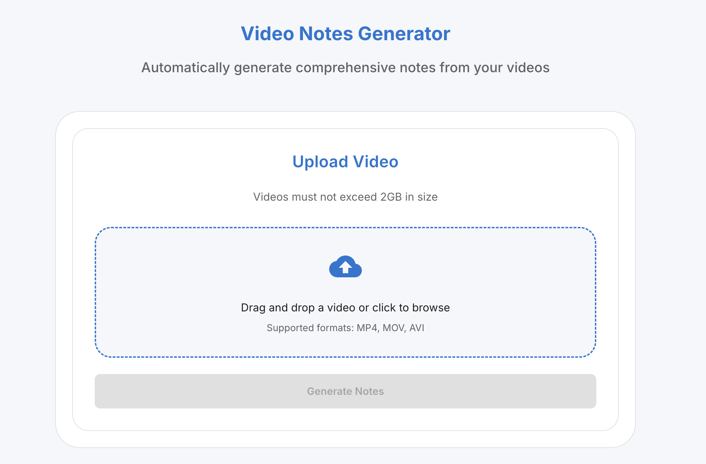
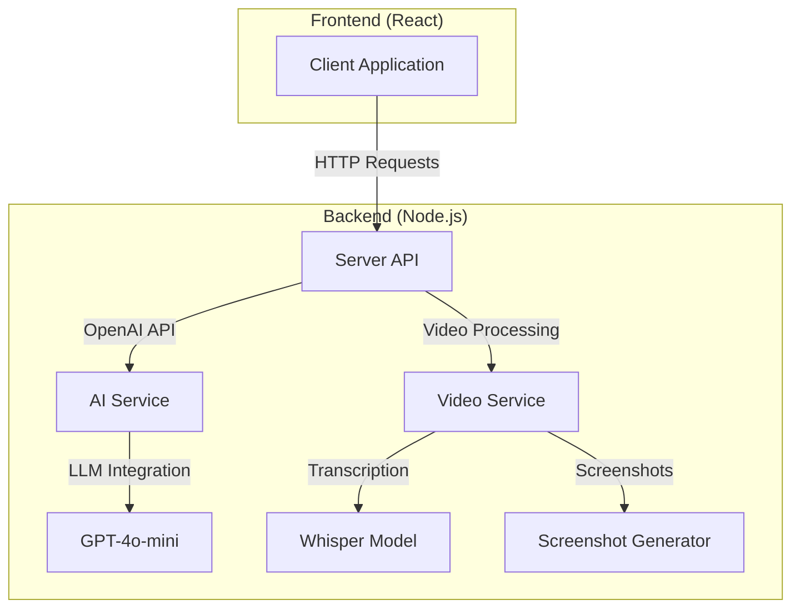

# Getting Started with Video Notes Generator



**Video Notes Generator** is a tool that transforms video content into structured, easy-to-navigate documentation. It’s designed to help you quickly extract and organize information from any video where knowledge is being shared — like lectures, interviews, presentations, or recorded meetings.

Here’s what it does:

- **Transcribes speech** using OpenAI’s Whisper model, with accurate timestamps throughout
- **Captures screenshots** at scene changes and embeds them directly into the notes to provide visual context
- **Breaks down transcripts** into logical, well-structured sections to fit AI processing limits
- **Generates content** using OpenAI models, including:
  - A detailed notes summary with timestamps
  - A TL;DR-style overview
  - A glossary of technical terms
  - A list of potential FAQs based on the video content
- **Outputs everything** in multiple formats (Markdown, RTF, HTML), and bundles it all into a downloadable ZIP archive

It’s especially useful when you want to **turn video into something you can skim, search, or repurpose** — whether that’s for study, documentation, or team knowledge sharing. 

This software is offered free but if you find it useful then feel free to express your appreciation by [buying me a coffee](https://www.paypal.com/donate/?hosted_button_id=2ZALZKUKH6CTC)

This guide will walk you through setting up the Video Notes Generator application for development and usage.

## Prerequisites

Before you begin, ensure you have the following installed:
- [Node.js](https://nodejs.org/) (v14 or higher)
- [npm](https://www.npmjs.com/) (v6 or higher) or [yarn](https://yarnpkg.com/)
- [OpenAI API Key](https://platform.openai.com/api-keys)

# Installation Instructions

## ENV File

Rename env.example to .env
Add your OpenAI API key to the .env file

## Server Setup

1. Navigate to the server directory:

    ```sh
    cd server
    ```

2. Install the necessary dependencies:

    ```sh
    npm install
    ```

3. Download the whisper model (148MB)

    ```sh
    
    curl -L https://huggingface.co/ggerganov/whisper.cpp/resolve/main/ggml-base.en.bin -o ./node_modules/whisper-node/lib/whisper.cpp/models/ggml-base.en.bin
    ```
    
    > Note: The whisper model file (ggml-base.en.bin) is over 100MB and cannot be stored in the GitHub repository. You need to download it from Hugging Face using the command above.

4. Start the server:

    ```sh
    npm start
    ```

    > Note: The first time you start the server, it will attempt to install Whisper locally.

## Client Setup

***Note: you will need to open a separate terminal window***

1. Navigate to the client directory:
    ```sh
    cd client
    ```

2. Install the necessary dependencies:
    ```sh
    npm install
    ```

3. Start the client:
    ```sh
    npm start
    ```

The application should now be running at [http://localhost:5173](http://localhost:5173).

# Concepts

This document provides an overview of the Video Notes Generator application workflow and architecture, explaining how the different components work together to process videos and generate comprehensive notes.

## Application Workflow

The Video Notes Generator follows a comprehensive end-to-end workflow to transform video content into structured notes:

### 1. Video Selection and Processing

- User uploads or selects a video file through the web interface
- The application validates the video format and size (up to 2GB)
- The video is saved to a temporary location for processing

### 2. Audio Extraction

- FFMPEG extracts the audio track from the video file
- The audio is saved as a separate file in an audio folder
- Audio is optimized for speech recognition (16kHz, mono channel)

### 3. Screenshot Generation

- FFMPEG analyzes the video for scene changes using a minimum scene change threshold (0.15)
- Screenshots are automatically captured at detected scene changes
- A minimum time gap (10 seconds) is enforced between screenshots to avoid duplicates
- Screenshots are limited to a maximum number (50) to prevent excessive image generation
- All screenshots are saved to an images folder with timestamps as filenames

### 4. Transcription with Whisper

- The extracted audio is sent to a local instance of the Whisper model (base.en)
- Whisper processes the audio and generates a transcript with word-level timestamps
- The raw transcript is saved in both JSON and formatted text formats
- Timestamps are formatted in HH:MM:SS format at regular intervals (every 5 seconds)

### 5. Transcript Processing

- The transcript is analyzed and divided into logical chunks
- Chunks are sized to optimize for token limits (approximately 3 characters per token)
- For markdown content, chunking preserves document structure by splitting at headings
- Timestamps are preserved throughout the chunking process

### 6. AI Processing with OpenAI

- Multiple calls are made to GPT-4o-mini through the OpenAI
- Each chunk is processed with specialized prompts designed for specific outputs
- The model returns structured JSON responses for each prompt
- Failed API calls are automatically retried with exponential backoff
- All JSON results are saved to separate output files for each processing goal

### 7. Content Generation

- The application runs a series of specialized prompts, each generating specific content:
  - Main notes with headers, timestamps, and detailed content
  - Executive summary with key points
  - Glossary of technical terms and definitions
  - FAQ section with questions and answers
  - TL;DR with title and concise summary
- Each prompt's output is stored as structured JSON in separate files

### 8. Document Creation

- The JSON outputs from all prompts are consolidated into a cohesive structure
- The application integrates screenshots at appropriate timestamps in the documents
- Three output formats are generated:
  - Markdown (.md) for easy viewing and editing
  - Rich Text Format (.rtf) for word processors
  - HTML for web viewing with enhanced formatting

### 9. Final Output

- All generated files (transcripts, notes, images, JSON data) are packaged
- A ZIP file is created containing all outputs organized in folders
- The user can download the complete package or view individual files

This automated workflow transforms a video into comprehensive, structured notes with minimal user intervention, making it an efficient tool for knowledge extraction and documentation.

## System Architecture

The Video Notes Generator follows a client-server architecture with clear separation of concerns:



## Key Components

### Frontend Components

1. **Video Upload Component**: Handles file selection, validation, and upload to the server
2. **Processing Status Component**: Displays progress and status of video processing
3. **Notes Display Component**: Renders the generated notes in a readable format

### Backend Components

1. **API Layer**: Express routes that handle client requests
2. **Video Processing Service**: Manages video file handling, transcription, and screenshot generation
3. **Document Processing Service**: Orchestrates the generation of notes from transcripts
4. **AI Integration Service**: Communicates with the OpenAI to generate intelligent content
5. **Screenshot Generation Service**: Uses FFMPEG to extract key frames from videos

### FFMPEG for Screenshots

The application uses FFMPEG, a powerful multimedia framework, to generate screenshots from video files:

1. **Scene Change Detection**: FFMPEG analyzes the video to identify significant scene changes, ensuring screenshots capture key visual transitions
2. **Timestamp-based Extraction**: FFMPEG extracts frames at these identified scene change timestamps throughout the video
3. **Quality Control**: Images are generated at an optimal resolution and quality for inclusion in notes
4. **Batch Processing**: Multiple screenshots are generated in a single FFMPEG process for efficiency
5. **Integration with Notes**: Screenshots are automatically embedded in the generated notes with relevant context

Example FFMPEG commands used:
```bash
# Scene change detection
ffmpeg -i video.mp4 -vf "select=gt(scene\,0.4),metadata=print" -f null -

# Screenshot extraction at detected scene changes
ffmpeg -i video.mp4 -ss [timestamp] -frames:v 1 -q:v 2 output_[timestamp].jpg
```

This approach ensures visual context is provided alongside the textual content, enhancing the comprehensiveness of the generated notes.

## Data Flow

**Video Upload**:
   - User uploads a video file
   - File is validated and stored on the server
   - A unique subfolder is created for all processing artifacts

**Transcription**:
   - Whisper model processes the audio to generate a raw transcript
   - Transcript is saved as a text file

**AI Processing**:
   - Transcript is sent to the OpenAI in manageable chunks
   - AI generates structured content for different sections (summary, glossary, FAQs, etc.)
   - Results are combined and processed

**Document Generation**:
   - Markdown document is created with all sections
   - Document is converted to additional formats (RTF, HTML)
   - Screenshots are integrated at appropriate timestamps

**Result Delivery**:
   - All generated files are packaged into a ZIP archive
   - Download link is provided to the user

## Storage Structure

Each processed video has its own directory structure:

```
docs/
└── [video-id]/
    ├── transcript.txt
    ├── transcript.json
    ├── images/
    │   └── [timestamp].jpg
    ├── markdown/
    │   └── transcript.md
    ├── rtf/
    │   └── transcript.rtf
    ├── html/
    │   └── transcript.html
    └── zip/
        └── transcript.zip
```

## Communication Patterns

- **Client-Server Communication**: RESTful API endpoints using HTTP
- **Server-AI Communication**: Asynchronous requests to OpenAI
- **Status Updates**: Polling mechanism to check processing status

## Troubleshooting Common Issues

### Whisper Model Installation

If you encounter issues with the Whisper model installation:

1. Ensure the model file exists in the whispermodel directory
2. Manually create the destination directory if it doesn't exist:
   ```sh
   mkdir -p ./server/node_modules/whisper-node/lib/whisper.cpp/models/
   ```
3. Try copying the model file again

### API Connection Issues

If the client cannot connect to the server:

1. Verify the server is running on port 3000
2. Check CORS settings in `server/config/index.js`
3. Ensure the client is configured to use the correct API endpoint (default: `http://localhost:3000`)


## Never setup you computer for Development? 

Instructions for a Mac

## **1\. System Prerequisites**

First, you need to install these fundamental tools:

**Install Homebrew** (macOS package manager):  
/bin/bash \-c "$(curl \-fsSL https://raw.githubusercontent.com/Homebrew/install/HEAD/install.sh)"

**Install Node.js and npm** (v14 or higher required):  
brew install node

**Install Git** (for cloning the repository):  
brew install git

## **2\. Project Setup**

**Clone or download the repository**:  
git clone \[repository-url\]

Or download as a ZIP file and extract it

**Navigate to the project directory**:  
cd videnotesgen
  
3. **Create environment file**:  
   * Create a `.env` file in the root directory

Add OpenAI API key:  
OPENAI\_API\_KEY\=your\_openai\_api\_key

*   
  * The user would need to sign up for an OpenAI account and generate an API key at [platform.openai.com](https://platform.openai.com/)

## **3\. Server Setup**

**Install server dependencies**:  
cd server  
npm install

**Download the Whisper model** (148MB):  
curl \-L https://huggingface.co/ggerganov/whisper.cpp/resolve/main/ggml-base.en.bin \-o ./node\_modules/whisper-node/lib/whisper.cpp/models/ggml-base.en.bin
  
   * This step is crucial as the model file is too large for GitHub and must be downloaded separately

If the directory doesn't exist, they may need to create it:  
mkdir \-p ./node\_modules/whisper-node/lib/whisper.cpp/models/

**Start the server**:  
npm start
  
   * The server will run on port 3000 by default  
   * First-time startup will include Whisper model initialization

## **4\. Client Setup**

**Open a new terminal window**

**Install client dependencies**:  
cd client  
npm install

**Start the client**:  
npm start

  * The client will run on port 5173 by default  
   * Access the application at [http://localhost:5173](http://localhost:5173/)

## **5\. Additional macOS-Specific Considerations**

 **FFMPEG Installation**:  
   * The application uses FFMPEG for video processing

While the package.json includes FFMPEG dependencies, if there are issues, the user might need to install it manually:  

brew install ffmpeg
 
**File Permissions**:  

   * macOS may prompt for permissions when accessing video files  
   * The user should grant necessary permissions when prompted  

 **Network Access**:  

   * Allow network access for both client and server applications if macOS firewall prompts
     
**Storage Requirements**:  
   * Ensure at least 500MB of free space for the application and its dependencies  
   * Additional space needed for video processing (varies based on video size)


## Disclaimer

This software is provided free of charge for personal and non-commercial use. You are permitted to use, modify, and share it only with proper credit to the original author (me). Commercial use, resale, or redistribution for profit is strictly prohibited without prior written permission.

This software is provided "as is", without any warranties—express or implied. I do not accept any responsibility for any issues, damages, or legal consequences resulting from the use or misuse of this software.

By using this software, you agree to these terms.