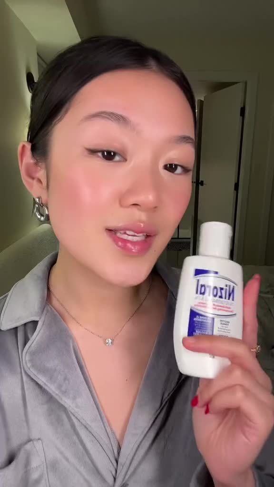
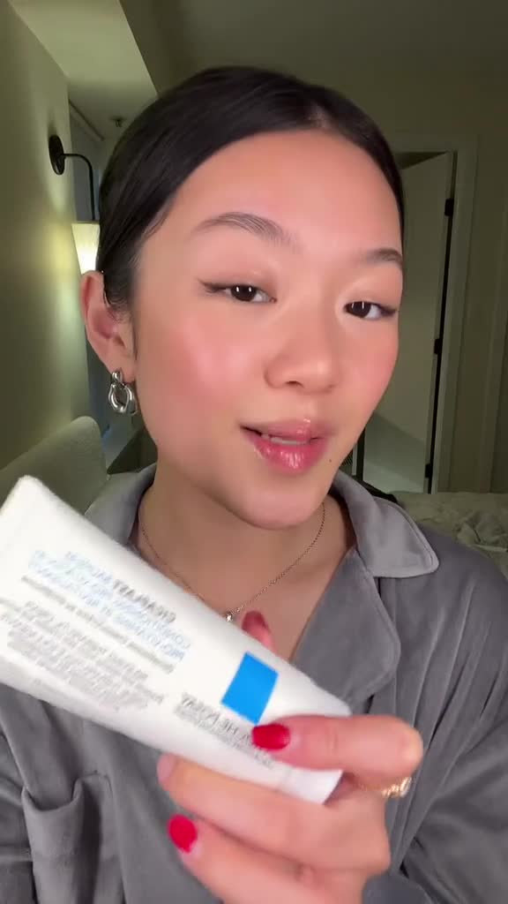
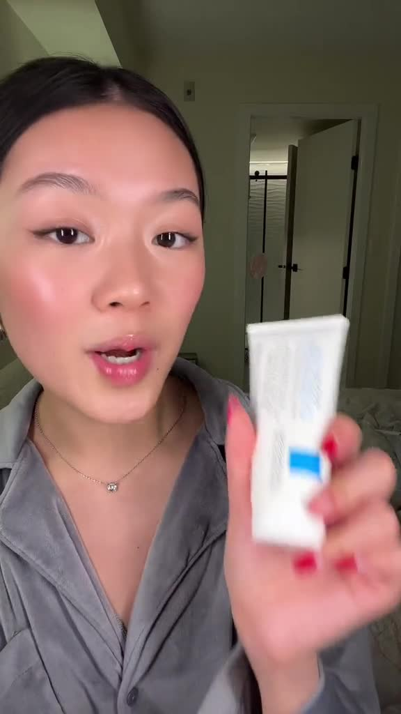
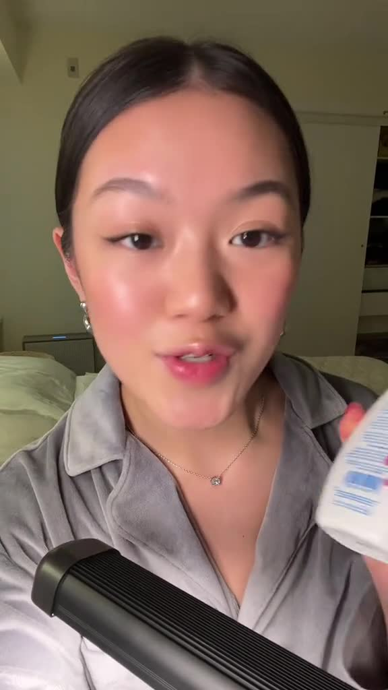
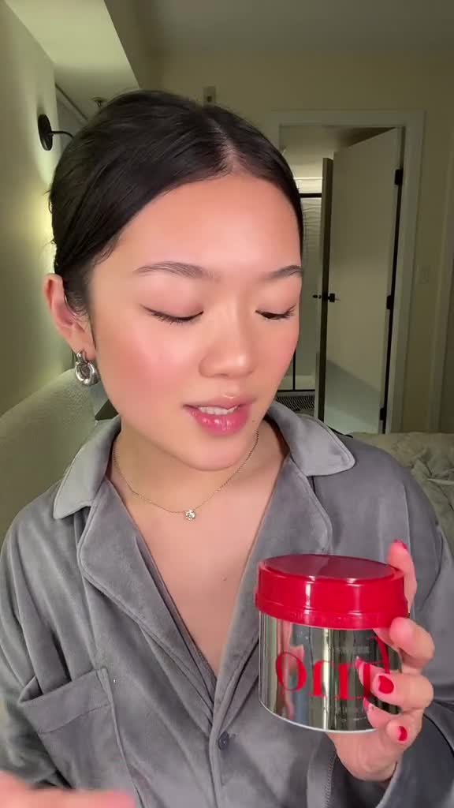

This content discusses a range of multi-purpose skincare products designed to address issues like dandruff, fungal acne, and hair loss, emphasizing their effectiveness through personal anecdotes. It highlights Trader Joe's moisturizing shaving cream for its superior moisturizing properties, La Holish Poise iBombi 5 for skin irritation relief, Vannock cream as a versatile facial cleanser suitable for various skin types, and Fino premium touch hair mask for its luxurious feel and long-standing reliability.

## Summary 
### Multi-Purpose Skincare Solutions
The discussion covers various skincare products that serve multiple purposes, particularly for conditions such as dandruff, fungal acne, and hair loss. A specific product is highlighted for its effectiveness in treating these issues, with personal anecdotes illustrating its use as a preventative measure and treatment. The product is described as essential in maintaining skin health, especially during winter months when conditions may worsen.

### Moisturizing Shaving Cream
Trader Joe's moisturizing cream shave in honey mango is presented as an unexpectedly superior shaving product. It is characterized by its deep moisturizing properties, which leave the skin nourished and shiny post-use. The formulation softens hair, allowing for a smoother razor glide, thereby reducing the likelihood of nicks and razor bumps. This product exemplifies how effective shaving creams can enhance the shaving experience.

### Effective Treatment for Skin Irritation
The La Holish Poise iBombi 5 is emphasized as a reliable remedy for skin irritation, particularly for bumps that can arise after shaving. A personal testament indicates that using this product as a mask overnight can lead to visible improvement by morning, showcasing its efficacy in promoting clearer skin and reducing inflammation.

### Gentle Facial Cleanser
Vannock cream is noted as the best facial cleanser experienced by the speaker, indicating its versatility in addressing various skin issues. The description suggests that this product is effective regardless of the skin condition one might encounter, making it a staple in skincare routines. Its gentle formulation is suitable for diverse skin types, further enhancing its appeal.

### Premium Hair Care
The Fino premium touch hair mask is introduced as a top-tier hair care product, praised for its ability to leave hair feeling soft, silky, and glossy after use. The speaker mentions a personal history with this product, having used it since childhood, which adds a layer of trust and reliability. The sensory quality of the hair mask is highlighted, suggesting it may also have a pleasant fragrance that enhances the overall user experience.

## Key Points 
**Multi-Purpose Skincare Solutions** - 
 \bullet  Various skincare products serve multiple purposes for issues like dandruff, fungal acne, and hair loss.\line \bullet  A highlighted product is effective for both treatment and prevention, crucial for maintaining skin health, especially in winter.

**Moisturizing Shaving Cream** - 
 \bullet  Trader Joe's moisturizing cream shave in honey mango is an unexpectedly superior shaving product.\line \bullet  It deeply moisturizes the skin, softens hair for a smoother shave, and reduces nicks and razor bumps.

**Effective Treatment for Skin Irritation** - 
 \bullet  La Holish Poise iBombi 5 is a reliable remedy for skin irritation, particularly post-shaving bumps.\line \bullet  Using it as an overnight mask can lead to visible improvement by morning, promoting clearer skin.

**Gentle Facial Cleanser** - 
 \bullet  Vannock cream is praised as the best facial cleanser, versatile for various skin issues.\line \bullet  Its gentle formulation makes it suitable for all skin types, enhancing its appeal as a skincare staple.

**Premium Hair Care** - 
 \bullet  Fino premium touch hair mask is celebrated for leaving hair soft, silky, and glossy.\line \bullet  A long-term user highlights its trustworthiness and pleasant sensory qualities, enhancing the overall experience.

## Glossary 
**Dandruff:** A common scalp condition characterized by flaking skin, often accompanied by itching and irritation.

**Effective Treatment:** A method or product that successfully alleviates a problem or condition, demonstrating noticeable improvement.

**Fungal Acne:** A skin condition caused by an overgrowth of yeast on the skin, often mistaken for regular acne, leading to bumps and irritation.

**Gentle Facial Cleanser:** A mild product designed to cleanse the face without causing irritation or stripping the skin of its natural moisture.

**Hair Loss:** The condition of losing hair, which can occur due to various factors including genetics, illness, or environmental influences.

**Moisturizing Shaving Cream:** A shaving product that hydrates the skin while providing a smooth surface for shaving, reducing irritation and promoting comfort.

**Premium Hair Care:** High-quality products specifically designed to nourish and enhance the health and appearance of hair.

**Skin Irritation:** A condition characterized by redness, itching, and discomfort on the skin, often resulting from shaving, allergens, or other irritants.

**Vannock Cream:** A specific brand of facial cleanser noted for its versatility and effectiveness in addressing various skin issues.

## FAQs 
**What are multi-purpose skincare solutions?**
 Multi-purpose skincare solutions are products designed to address various skin conditions, such as dandruff, fungal acne, and hair loss, often serving as both preventive measures and treatments.

**How does Trader Joe's moisturizing cream shave in honey mango enhance the shaving experience?**
 It has deep moisturizing properties that nourish the skin, soften hair for a smoother razor glide, and reduce the likelihood of nicks and razor bumps.

**What is the La Holish Poise iBombi 5 used for?**
 It is a reliable remedy for skin irritation, particularly effective for bumps that can arise after shaving, and can be used as an overnight mask to promote clearer skin.

**What makes Vannock cream a good facial cleanser?**
 Vannock cream is praised for its versatility in addressing various skin issues and its gentle formulation, making it suitable for diverse skin types.

**What are the benefits of using the Fino premium touch hair mask?**
 It leaves hair feeling soft, silky, and glossy, and is trusted by users due to personal history, potentially enhanced by a pleasant fragrance.

